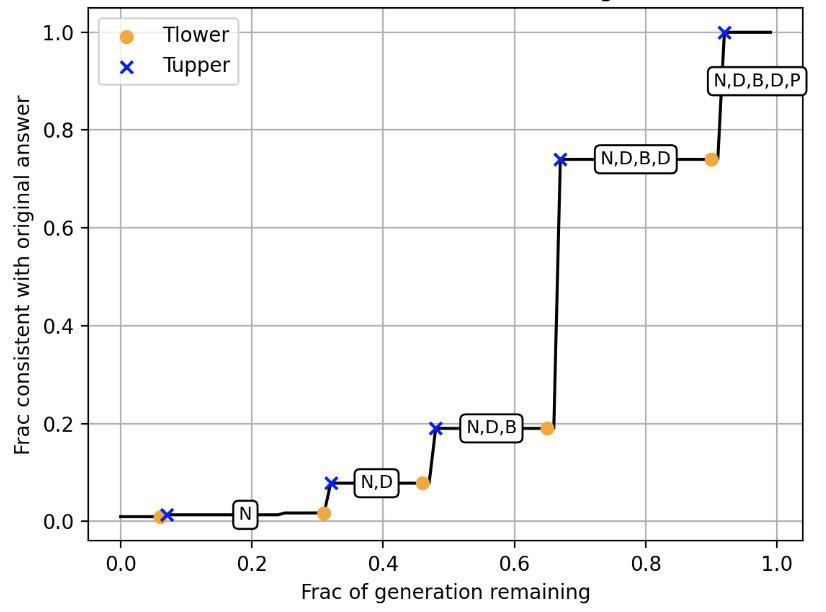

# Examining feature localization in autoregressive language models

We provide a suite of tools to examine the phenomena of **feature localization**, where some aspect of the final generation appears during a narrow intervals of the sampling procedure of a stochastic localization sampler, for **autoregressive language models**.

## Installation
In order to install the required packages and dependences, use the following conda command.
```bash
conda env create -f environment.yml
```
We also use the `grade_answer` function from the `prm800k` library to grade the the LLM answers to math questions [(repo here)](https://github.com/openai/prm800k).
```bash
git clone https://github.com/openai/prm800k.git
cd prm800k
pip install -e . 
pip install pylatexenc
```

You may also need to run the following lines of python code to adjust relative imports within  `prm800k`.
```python
with open('/content/prm800k/prm800k/grading/grader.py', 'r+') as file:
    file.write(file.read().replace('from grading import math_normalize', 'from . import math_normalize'))
```

## Structured output experiments
We describe how to reproduce our _structured output experiments_, where we explicitly compute the location of feature localization windows for a family of _simple outputs_. 

<p align="center">
  
</p>


The main challenge is to compute the total variation for different latents in a way that doesn't require too many samples. One way to do this is to use a  fill-in-the-blank style prompt. For example, here is the default prompt we provide in `configuration.py`. 
```
Complete the following by choosing only one option for each blank. The options are provided in parentheses, and your response must match the exact case and meaning of the chosen option. Respond with only the completed sentence, no explanations or additional text.
1. The (Pirate/Ninja) jumped across the ship.
2. She adopted a (Dog/Cat) from the shelter.
3. The (River/Bridge) sparkled under the sun.
4. A (Dragon/Knight) guarded the castle gates.
5. He ordered (Pizza/Sushi) for dinner.
```
An example response would be 
```
1. The Pirate jumped across the ship.
2. She adopted a Dog from the shelter.
3. The River sparkled under the sun.
4. A Dragon guarded the castle gates.
5. He ordered Pizza for dinner.
```
You can reproduce our experiments with the default prompt on Llama 3.1-8B using the following command.
```bash
## Structured output experiment
python experiments/structured_output/run_structured_output_experiments.py --model_id meta-llama/Llama-3.1-8B-Instruct --num_samples 10000
```
The results will be in `results/StructuredNoiseDenoise/StructuredNoiseDenoise_model=meta-llama-Llama-3.1-8B-Instruct_num_samples=10000`. The most important files in that folder are:
1. `structured_responses.csv` contains all the model responses and some useful additional information.
2. `ex_hierarchy/ex_{i}.png` are plots of the amount of truncation we apply versus the probability of sampling to the same piece of text. They also include the `Tlower` and `Tupper` bounds predicted by the theory.

## Chain of thought reasoning experiments
<p align="center">
  
</p>

For our chain of thought experiments, use the following example command. Here we set ``--answer_type math`` to set the grader to be the math question grader and ``--task math`` to specify the type of problem in the system prompt. To run multiple times for each truncation level, specify ``--num_per_noise``. 

```bash
## Chain of thought experiment
python experiments/chain_of_thought/run_qa_noisedenoise.py --model_id meta-llama/Llama-3.1-8B-Instruct --dataset competition_math --split test --task math --num_samples 10000 --answer_type math
```

See the script `scripts/generate_QA_data_total.sh` for the correct commands for all datasets we consider in the paper and the notebook `notebooks/COT Feature Localization.ipynb` for instructions to analyze the data that is produced. 

## Jailbreak prompt detection method
To reproduce our jailbreak prompt detection method, run the following command. 

```bash
## Likelihood ratio experiment
python experiments/jailbreak/run_likelihood_ratio_jailbreak.py --aligned_model meta-llama/Llama-3.1-8B-Instruct \
        --unaligned_model grimjim/Llama-3.1-8B-Instruct-abliterated_via_adapter
```

The results will be placed in `results/JailbreakLikelihoodRatio/JailbreakLikelihoodRatio_aligned=meta-llama-Llama-3.1-8B-Instruct_unaligned=grimjim-Llama-3.1-8B-Instruct-abliterated_via_adapter_dataset=Mechanistic-Anomaly-Detection-llama3-jailbreaks_num_samples=None`. The most important files inside have the form

1. `{aligned/unaligned}_{jailbreak/benign}_logprobs.pt` denoting the logprobs of the aligned/unaligned model on the jailbroken/benign dataset. 

See the notebook `notebooks/Jailbreak Likelihood Ratio Detection.ipynb` for instructions to compute the performance of the different methods. 
<p align="center">
  
</p>

